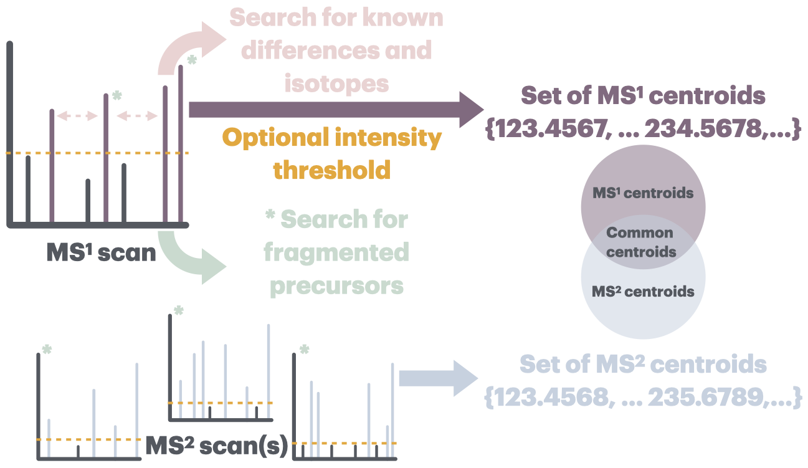

# ion-type-analysis

This repository contains the methods and code used to analyze ion types in <https://metabolomics.blog/2024/10/isf/>.

An overview of the process is illustrated below.



## Dependencies


### Software

To replicate our analysis, you will need the following software:

- The custom MZmine version available from the <https://github.com/Adafede/mzmine/tree/fragments_analysis> fork 
  - As it is not yet included in the latest MZmine version, building it might be _not so simple_... for details about installation, refer to <https://mzmine.github.io/mzmine_documentation/contribute_intellij.html>.
- [Python](https://www.python.org/) (>=3.10)
  - UV:
    ```bash
    curl -LsSf https://astral.sh/uv/install.sh | sh
    ````
  - to install python dependencies:
    ```bash
    uv sync
    ```
- [R](https://www.r-project.org/) (>=4.3) (to reproduce the figures)

### Files

In case you just want to give a quick try, 6 example files are provided in `data/example/*.mzml`.

To replicate the full analysis, you will need the following datasets:

- Direct Injection ToF CID 20ev Positive: [zenodo.14218309](https://doi.org/10.5281/zenodo.14218309)
- Direct Injection ToF CID 40ev Positive: [zenodo.14218309](https://doi.org/10.5281/zenodo.14218309)
- Direct Injection ToF CID 60ev Positive: [zenodo.14218309](https://doi.org/10.5281/zenodo.14218309)
<!-- - Direct Injection ToF EAD 12ke Positive: :warning: TO BE UPLOADED SOON :warning:
- Direct Injection ToF EAD 16ke Positive: :warning: TO BE UPLOADED SOON :warning:
- Direct Injection ToF EAD 24ke Positive: :warning: TO BE UPLOADED SOON :warning: -->
- Direct Injection ToF CID 20ev Negative: [zenodo.14218309](https://doi.org/10.5281/zenodo.14218309)
- Direct Injection ToF CID 40ev Negative: [zenodo.14218309](https://doi.org/10.5281/zenodo.14218309)
- Direct Injection ToF CID 60ev Negative: [zenodo.14218309](https://doi.org/10.5281/zenodo.14218309)
<!-- - Direct Injection ToF EAD 12ke Negative: :warning: TO BE UPLOADED SOON :warning:
- Direct Injection ToF EAD 16ke Negative: :warning: TO BE UPLOADED SOON :warning:
- Direct Injection ToF EAD 24ke Negative: :warning: TO BE UPLOADED SOON :warning: -->
- Direct Injection Obitrap Positive: [zenodo.13890851](https://doi.org/10.5281/zenodo.13890851)
- Direct Injection Obitrap Negative: [zenodo.13890851](https://doi.org/10.5281/zenodo.13890851)
- Liquid Chromatography Astral Positive: [MSV000093526](https://massive.ucsd.edu/ProteoSAFe/dataset.jsp?task=5b9076c6cd134284806672033569996e)

For the files on MASSIVE, a convenience script using <https://github.com/Wang-Bioinformatics-Lab/downloadpublicdata> is available:

```bash
uv run python3 ./notebooks/download_massive.py ./data/MSV000093526.txt /Volumes/T7_Shield/MSV000093526 /Volumes/T7_Shield/MSV000093526/MSV000093526_summary.tsv
```

For the files on Zenodo, a convenience script is available:

```bash
# MSnLib dataset
uv run python3 ./notebooks/download_zenodo.py https://doi.org/10.5281/zenodo.13890851 20220601_mzml_mce_bioactive_positive.zip /Volumes/T7_Shield/20220601_mzml_mce_bioactive_positive.zip --unzip

uv run python3 ./notebooks/download_zenodo.py https://doi.org/10.5281/zenodo.13890851 20230130_mzml_mce_bioactive_negative.zip /Volumes/T7_Shield/20230130_mzml_mce_bioactive_negative.zip --unzip

uv run python3 ./notebooks/download_zenodo.py https://doi.org/10.5281/zenodo.13890851 20230404_mzml_pluskal_nih_negative.zip /Volumes/T7_Shield/20230404_mzml_pluskal_nih_negative.zip --unzip

uv run python3 ./notebooks/download_zenodo.py https://doi.org/10.5281/zenodo.13890851 20230404_mzml_pluskal_nih_positive.zip /Volumes/T7_Shield/20230404_mzml_pluskal_nih_positive.zip --unzip

uv run python3 ./notebooks/download_zenodo.py https://doi.org/10.5281/zenodo.13890851 20231123_mzml_mce_scaffold_negative.zip /Volumes/T7_Shield/20231123_mzml_mce_scaffold_negative.zip --unzip

uv run python3 ./notebooks/download_zenodo.py https://doi.org/10.5281/zenodo.13890851 20231123_mzml_mce_scaffold_positive.zip /Volumes/T7_Shield/20231123_mzml_mce_scaffold_positive.zip --unzip

uv run python3 ./notebooks/download_zenodo.py https://doi.org/10.5281/zenodo.13890851 20231124_mzml_otavapep_negative.zip /Volumes/T7_Shield/20231124_mzml_otavapep_negative.zip --unzip

uv run python3 ./notebooks/download_zenodo.py https://doi.org/10.5281/zenodo.13890851 20231124_mzml_otavapep_positive.zip /Volumes/T7_Shield/20231124_mzml_otavapep_positive.zip --unzip

uv run python3 ./notebooks/download_zenodo.py https://doi.org/10.5281/zenodo.13890851 mzml_20240405_pluskal_enammol_MSn_negative.zip /Volumes/T7_Shield/mzml_20240405_pluskal_enammol_MSn_negative.zip --unzip

uv run python3 ./notebooks/download_zenodo.py https://doi.org/10.5281/zenodo.14218309/mzml_neg_cid_20.zip /Volumes/T7_Shield/mzml_neg_cid_20.zip --unzip

uv run python3 ./notebooks/download_zenodo.py https://doi.org/10.5281/zenodo.14218309/mzml_neg_cid_40.zip /Volumes/T7_Shield/mzml_neg_cid_40.zip --unzip

uv run python3 ./notebooks/download_zenodo.py https://doi.org/10.5281/zenodo.14218309/mzml_neg_cid_60.zip /Volumes/T7_Shield/mzml_neg_cid_60.zip --unzip

uv run python3 ./notebooks/download_zenodo.py https://doi.org/10.5281/zenodo.14218309/mzml_pos_cid_20.zip /Volumes/T7_Shield/mzml_pos_cid_20.zip --unzip

uv run python3 ./notebooks/download_zenodo.py https://doi.org/10.5281/zenodo.14218309/mzml_pos_cid_40.zip /Volumes/T7_Shield/mzml_pos_cid_40.zip --unzip

uv run python3 ./notebooks/download_zenodo.py https://doi.org/10.5281/zenodo.14218309/mzml_pos_cid_60.zip /Volumes/T7_Shield/mzml_pos_cid_60.zip --unzip
```

#### Metadata

To speed up the analysis and only treat scans corresponding to standards, metadata files are needed:

⚠️ There is currently no way to pass these path to mzmine's batch, these will have to be edited manually!

```bash
uv run python3 .notebooks/download_metadata.py https://github.com/corinnabrungs/mass-spectral-library-network/blob/main/libraries/MSnLib/compounds/enamdisc_cleaned.tsv /Volumes/T7_Shield/enamdisc_cleaned.tsv
uv run python3 .notebooks/download_metadata.py https://github.com/corinnabrungs/mass-spectral-library-network/blob/main/libraries/MSnLib/compounds/enammol_cleaned.tsv /Volumes/T7_Shield/enammol_cleaned.tsv
uv run python3 .notebooks/download_metadata.py https://github.com/corinnabrungs/mass-spectral-library-network/blob/main/libraries/MSnLib/compounds/mcebio_cleaned.tsv /Volumes/T7_Shield/mcebio_cleaned.tsv
uv run python3 .notebooks/download_metadata.py https://github.com/corinnabrungs/mass-spectral-library-network/blob/main/libraries/MSnLib/compounds/mcedrug_cleaned.tsv /Volumes/T7_Shield/mcedrug_cleaned.tsv
uv run python3 .notebooks/download_metadata.py https://github.com/corinnabrungs/mass-spectral-library-network/blob/main/libraries/MSnLib/compounds/mcescaf_cleaned.tsv /Volumes/T7_Shield/mcescaf_cleaned.tsv
uv run python3 .notebooks/download_metadata.py https://github.com/corinnabrungs/mass-spectral-library-network/blob/main/libraries/MSnLib/compounds/nihnp_cleaned.tsv /Volumes/T7_Shield/nihnp_cleaned.tsv
uv run python3 .notebooks/download_metadata.py https://github.com/corinnabrungs/mass-spectral-library-network/blob/main/libraries/MSnLib/compounds/otavapep_cleaned.tsv /Volumes/T7_Shield/otavapep_cleaned.tsv
uv run python3 .notebooks/download_metadata.py https://raw.githubusercontent.com/zamboni-lab/ion-type-analysis/refs/heads/main/data/metadata_neg.tsv /Volumes/T7_Shield/metadata_neg.tsv
uv run python3 .notebooks/download_metadata.py https://raw.githubusercontent.com/zamboni-lab/ion-type-analysis/refs/heads/main/data/metadata_pos.tsv /Volumes/T7_Shield/metadata_pos.tsv
```

## Performing the analysis

To use the MZmine ion type analysis module:

### Example

```bash
# NOTE: `mzmine-dev` refers to the MZmine executable built from the above mentioned branch
mzmine-dev -batch ".mzmine/batch/di_tof_example.mzbatch" -i "./data/example/*.mzML" -o "./data/example/di_tof_5_20ev_pos/{}"
```

This will give you the results for the example file.

### Full

To reproduce the full results:

```bash
mzmine-dev -t "/Volumes/T7_Shield/tmp" -b ".mzmine/batch/di_ot_5_enamdisc_neg.mzbatch" -i "/Volumes/T7_Shield/mzml_20240502_pluskal_enamdisc_MSn_negative/*.mzML" -o "./data/di_ot_5_enamdisc_neg/{}"

mzmine-dev -t "/Volumes/T7_Shield/tmp" -b ".mzmine/batch/di_ot_5_enamdisc_pos.mzbatch" -i "/Volumes/T7_Shield/mzml_20240502_pluskal_enamdisc_MSn_positive/*.mzML" -o "./data/di_ot_5_enamdisc_pos/{}"

mzmine-dev -t "/Volumes/T7_Shield/tmp" -b ".mzmine/batch/di_ot_5_enammol_neg.mzbatch" -i "/Volumes/T7_Shield/mzml_20240405_pluskal_enammol_MSn_negative/*.mzML" -o "./data/di_ot_5_enammol_neg/{}"

mzmine-dev -t "/Volumes/T7_Shield/tmp" -b ".mzmine/batch/di_ot_5_enammol_pos.mzbatch" -i "/Volumes/T7_Shield/mzml_20240405_pluskal_enammol_MSn_positive/*.mzML" -o "./data/di_ot_5_enammol_pos/{}"

mzmine-dev -t "/Volumes/T7_Shield/tmp" -b ".mzmine/batch/di_ot_5_mcebio_neg.mzbatch" -i "/Volumes/T7_Shield/20230130_mzml_mce_bioactive_negative/*.mzML" -o "./data/di_ot_5_mcebio_neg/{}"

mzmine-dev -t "/Volumes/T7_Shield/tmp" -b ".mzmine/batch/di_ot_5_mcebio_pos.mzbatch" -i "/Volumes/T7_Shield/20220601_mzml_mce_bioactive_positive/*.mzML" -o "./data/di_ot_5_mcebio_pos/{}"

mzmine-dev -t "/Volumes/T7_Shield/tmp" -b ".mzmine/batch/di_ot_5_mcedrug_neg.mzbatch" -i "/Volumes/T7_Shield/mzml_20240408_pluskal_mcedrug_MSn_negative/*.mzML" -o "./data/di_ot_5_mcedrug_neg/{}"

mzmine-dev -t "/Volumes/T7_Shield/tmp" -b ".mzmine/batch/di_ot_5_mcedrug_pos.mzbatch" -i "/Volumes/T7_Shield/mzml_20240408_pluskal_mcedrug_MSn_positive/*.mzML" -o "./data/di_ot_5_mcedrug_pos/{}"

mzmine-dev -t "/Volumes/T7_Shield/tmp" -b ".mzmine/batch/di_ot_5_mcescaf_neg.mzbatch" -i "/Volumes/T7_Shield/20231123_mzml_mce_scaffold_negative/*.mzML" -o "./data/di_ot_5_mcescaf_neg/{}"

mzmine-dev -t "/Volumes/T7_Shield/tmp" -b ".mzmine/batch/di_ot_5_mcescaf_pos.mzbatch" -i "/Volumes/T7_Shield/20231123_mzml_mce_scaffold_positive/*.mzML" -o "./data/di_ot_5_mcescaf_pos/{}"

mzmine-dev -t "/Volumes/T7_Shield/tmp" -b ".mzmine/batch/di_ot_5_nihnp_neg.mzbatch" -i "/Volumes/T7_Shield/20230404_mzml_pluskal_nih_negative/*.mzML" -o "./data/di_ot_5_nihnp_neg/{}"

mzmine-dev -t "/Volumes/T7_Shield/tmp" -b ".mzmine/batch/di_ot_5_nihnp_pos.mzbatch" -i "/Volumes/T7_Shield/20230404_mzml_pluskal_nih_positive/*.mzML" -o "./data/di_ot_5_nihnp_pos/{}"

mzmine-dev -t "/Volumes/T7_Shield/tmp" -b ".mzmine/batch/di_ot_5_otavapep_neg.mzbatch" -i "/Volumes/T7_Shield/20231124_mzml_otavapep_negative/*.mzML" -o "./data/di_ot_5_otavapep_neg/{}"

mzmine-dev -t "/Volumes/T7_Shield/tmp" -b ".mzmine/batch/di_ot_5_otavapep_pos.mzbatch" -i "/Volumes/T7_Shield/20231124_mzml_otavapep_positive/*.mzML" -o "./data/di_ot_5_otavapep_pos/{}"

mzmine-dev -t "/Volumes/T7_Shield/tmp" -b ".mzmine/batch/di_tof_0_pos.mzbatch" -i "/Volumes/T7_Shield/mzml_pos_cid_20/*.mzML" -o "./data/di_tof_0_20ev_pos/{}"

mzmine-dev -t "/Volumes/T7_Shield/tmp" -b ".mzmine/batch/di_tof_5_neg.mzbatch" -i "/Volumes/T7_Shield/mzml_neg_cid_20/*.mzML" -o "./data/di_tof_5_20ev_neg/{}"

mzmine-dev -t "/Volumes/T7_Shield/tmp" -b ".mzmine/batch/di_tof_5_pos.mzbatch" -i "/Volumes/T7_Shield/mzml_pos_cid_20/*.mzML" -o "./data/di_tof_5_20ev_pos/{}"

mzmine-dev -t "/Volumes/T7_Shield/tmp" -b ".mzmine/batch/di_tof_5_pos.mzbatch" -i "/Volumes/T7_Shield/mzml_pos_cid_40/*.mzML" -o "./data/di_tof_5_40ev_pos/{}"

mzmine-dev -t "/Volumes/T7_Shield/tmp" -b ".mzmine/batch/di_tof_5_pos.mzbatch" -i "/Volumes/T7_Shield/mzml_pos_cid_60/*.mzML" -o "./data/di_tof_5_60ev_pos/{}"

mzmine-dev -t "/Volumes/T7_Shield/tmp" -b ".mzmine/batch/di_tof_10_pos.mzbatch" -i "/Volumes/T7_Shield/mzml_pos_cid_20/*.mzML" -o "./data/di_tof_10_20ev_pos/{}"

mzmine-dev -t "/Volumes/T7_Shield/tmp" -b ".mzmine/batch/lc_at_5_pos.mzbatch" -i "/Volumes/T7_Shield/MSV000093526/*.mzML" -o "./data/lc_at_5_pos/{}"
```

<!-- mzmine-dev -t "/Volumes/T7_Shield/tmp" -b ".mzmine/batch/di_tof_0_pos.mzbatch" -i "/Volumes/T7_Shield/01_zeno/all_converted/pos/EAD/12/*.mzML" -o "./data/di_tof_0_12ke_pos/{}"

mzmine-dev -t "/Volumes/T7_Shield/tmp" -b ".mzmine/batch/di_tof_5_neg.mzbatch" -i "/Volumes/T7_Shield/01_zeno/all_converted/neg/EAD/12/*.mzML" -o "./data/di_tof_5_12ke_neg/{}"

mzmine-dev -t "/Volumes/T7_Shield/tmp" -b ".mzmine/batch/di_tof_5_pos.mzbatch" -i "/Volumes/T7_Shield/01_zeno/all_converted/pos/EAD/12/*.mzML" -o "./data/di_tof_5_12ke_pos/{}"

mzmine-dev -t "/Volumes/T7_Shield/tmp" -b ".mzmine/batch/di_tof_5_pos.mzbatch" -i "/Volumes/T7_Shield/01_zeno/all_converted/pos/EAD/16/*.mzML" -o "./data/di_tof_5_16ke_pos/{}"

mzmine-dev -t "/Volumes/T7_Shield/tmp" -b ".mzmine/batch/di_tof_5_pos.mzbatch" -i "/Volumes/T7_Shield/01_zeno/all_converted/pos/EAD/24/*.mzML" -o "./data/di_tof_5_24ke_pos/{}"

mzmine-dev -t "/Volumes/T7_Shield/tmp" -b ".mzmine/batch/di_tof_10_pos.mzbatch" -i "/Volumes/T7_Shield/01_zeno/all_converted/pos/EAD/12/*.mzML" -o "./data/di_tof_10_12ke_pos/{}" -->

#### Standards annotation

To speed up the process on the large sets, we first detect features corresponding to the injected compounds only (we still link all other ones later on).
For this, you'll need the library files downloaded previously to filter the number of features on which the analysis is performed.
This is absolutely not required (so you can apply the methodology on complex, unknown samples), the analysis will just take longer.

#### Known issues and fixes

Some of the zip contain `.file.mzML`. To get rid of those:

```bash
rm .??*
```

Some of the runs did not get any match:

```bash
uv run python3 ./notebooks/remove_empty.py -d ./data/di_ot_5_enamdisc_neg

uv run python3 ./notebooks/remove_empty.py -d ./data/di_ot_5_enamdisc_pos

uv run python3 ./notebooks/remove_empty.py -d ./data/di_ot_5_enammol_neg

uv run python3 ./notebooks/remove_empty.py -d ./data/di_ot_5_enammol_pos

uv run python3 ./notebooks/remove_empty.py -d ./data/di_ot_5_mcebio_neg

uv run python3 ./notebooks/remove_empty.py -d ./data/di_ot_5_mcebio_pos

uv run python3 ./notebooks/remove_empty.py -d ./data/di_ot_5_mcedrug_neg

uv run python3 ./notebooks/remove_empty.py -d ./data/di_ot_5_mcedrug_pos

uv run python3 ./notebooks/remove_empty.py -d ./data/di_ot_5_mcescaf_neg

uv run python3 ./notebooks/remove_empty.py -d ./data/di_ot_5_mcescaf_pos

uv run python3 ./notebooks/remove_empty.py -d ./data/di_ot_5_nihnp_neg

uv run python3 ./notebooks/remove_empty.py -d ./data/di_ot_5_nihnp_pos

uv run python3 ./notebooks/remove_empty.py -d ./data/di_ot_5_otavapep_neg

uv run python3 ./notebooks/remove_empty.py -d ./data/di_ot_5_otavapep_pos

uv run python3 ./notebooks/remove_empty.py -d ./data/di_ot_5_otavapep_pos

uv run python3 ./notebooks/remove_empty.py -d ./data/di_tof_0_20ev_pos

uv run python3 ./notebooks/remove_empty.py -d ./data/di_tof_5_20ev_neg

uv run python3 ./notebooks/remove_empty.py -d ./data/di_tof_5_20ev_pos

uv run python3 ./notebooks/remove_empty.py -d ./data/di_tof_5_40ev_pos

uv run python3 ./notebooks/remove_empty.py -d ./data/di_tof_5_60ev_pos

uv run python3 ./notebooks/remove_empty.py -d ./data/di_tof_10_20ev_pos
```

<!-- uv run python3 ./notebooks/remove_empty.py -d ./data/di_tof_0_12ke_pos

uv run python3 ./notebooks/remove_empty.py -d ./data/di_tof_5_12ke_neg

uv run python3 ./notebooks/remove_empty.py -d ./data/di_tof_5_12ke_pos

uv run python3 ./notebooks/remove_empty.py -d ./data/di_tof_5_16ke_pos

uv run python3 ./notebooks/remove_empty.py -d ./data/di_tof_5_24ke_pos

uv run python3 ./notebooks/remove_empty.py -d ./data/di_tof_10_12ke_pos -->

Finally filter ions not corresponding to feasible subformulas:

```bash
uv run python3 ./notebooks/filter_subformulas.py -d ./data/di_ot_5_enamdisc_neg

uv run python3 ./notebooks/filter_subformulas.py -d ./data/di_ot_5_enamdisc_pos

uv run python3 ./notebooks/filter_subformulas.py -d ./data/di_ot_5_enammol_neg

uv run python3 ./notebooks/filter_subformulas.py -d ./data/di_ot_5_enammol_pos

uv run python3 ./notebooks/filter_subformulas.py -d ./data/di_ot_5_mcebio_neg

uv run python3 ./notebooks/filter_subformulas.py -d ./data/di_ot_5_mcebio_pos

uv run python3 ./notebooks/filter_subformulas.py -d ./data/di_ot_5_mcedrug_neg

uv run python3 ./notebooks/filter_subformulas.py -d ./data/di_ot_5_mcedrug_pos

uv run python3 ./notebooks/filter_subformulas.py -d ./data/di_ot_5_mcescaf_neg

uv run python3 ./notebooks/filter_subformulas.py -d ./data/di_ot_5_mcescaf_pos

uv run python3 ./notebooks/filter_subformulas.py -d ./data/di_ot_5_nihnp_neg

uv run python3 ./notebooks/filter_subformulas.py -d ./data/di_ot_5_nihnp_pos

uv run python3 ./notebooks/filter_subformulas.py -d ./data/di_ot_5_otavapep_neg

uv run python3 ./notebooks/filter_subformulas.py -d ./data/di_ot_5_otavapep_pos

uv run python3 ./notebooks/filter_subformulas.py -d ./data/di_ot_5_otavapep_pos

uv run python3 ./notebooks/filter_subformulas.py -d ./data/di_tof_0_20ev_pos

uv run python3 ./notebooks/filter_subformulas.py -d ./data/di_tof_5_20ev_neg

uv run python3 ./notebooks/filter_subformulas.py -d ./data/di_tof_5_20ev_pos

uv run python3 ./notebooks/filter_subformulas.py -d ./data/di_tof_5_40ev_pos

uv run python3 ./notebooks/filter_subformulas.py -d ./data/di_tof_5_60ev_pos

uv run python3 ./notebooks/filter_subformulas.py -d ./data/di_tof_10_20ev_pos
```

<!-- uv run python3 ./notebooks/filter_subformulas.py -d ./data/di_tof_0_12ke_pos

uv run python3 ./notebooks/filter_subformulas.py -d ./data/di_tof_5_12ke_neg

uv run python3 ./notebooks/filter_subformulas.py -d ./data/di_tof_5_12ke_pos

uv run python3 ./notebooks/filter_subformulas.py -d ./data/di_tof_5_16ke_pos

uv run python3 ./notebooks/filter_subformulas.py -d ./data/di_tof_5_24ke_pos

uv run python3 ./notebooks/filter_subformulas.py -d ./data/di_tof_10_12ke_pos -->

## Reproducing the figures

You can reproduce the figures by using the following commands:

First, concatenate all files:

```bash
R < ./inst/scripts/concatenate_standards.R --no-save
```

Then, process the SMILES:

```bash
uv run python3 ./notebooks/count_groups.py
```

And finally the figures:

```bash
# NOTE: add the `--args example=TRUE` if you do not have all datasets
R < ./inst/scripts/plot_figures.R --no-save
```

## Methods in brief

Signals were extracted using a [custom version of mzmine](https://github.com/Adafede/mzmine/tree/fragments_analysis) (detailed parameters can be inspected in the [related batch files](https://github.com/zamboni-lab/ion-type-analysis/tree/correspondence/.mzmine/batch)).
For all datasets, background was removed at all MS levels using a factor of lowest signal of 5.
A tolerance of 5 mDa or 10 ppm was used for matching on MS<sup>1</sup>.
This tolerance was tripled for MS<sup>n>1</sup> levels.
For the ion type annotation, only isotope patterns with at least 3 members were considered.
Adducts were annotated based on the 8 most common theoretical _m/z_ differences reported as previously reported ([Nash et al., 2024](https://doi.org/10.1021/acs.analchem.4c00966))
Finally, fragments were annotated if a signal was found in any of the related MS<sup>n>1</sup> spectra.
For features corresponding to standards, the fragments list was further refined using BUDDY ([Xing et al., 2023](https://doi.org/10.1038/s41592-023-01850-x)).
Only fragments corresponding to possible subformulas within a 20mDa tolerance and below 4.5 Da difference of the precursor (allowing specifically for 2H and 4H loss) were kept. 

## Acknowledgments

Listed alphabetically below are the individuals whose contributions—whether through sharing ideas, code, or data—have been essential to the current analysis:
- [Corinna](https://github.com/corinnabrungs)
- [Mario](https://orcid.org/0000-0003-2125-4184)
- [Robin](https://github.com/robinschmid)
- [Steffen](https://github.com/SteffenHeu)
- [Yasin](https://github.com/YasinEl)

## Contact

To promote transparency and dialogue, we encourage you to share your thoughts and questions in the discussions section (<https://github.com/zamboni-lab/ion-type-analysis/discussions>). 
Your contributions are important for improving our shared knowledge.
