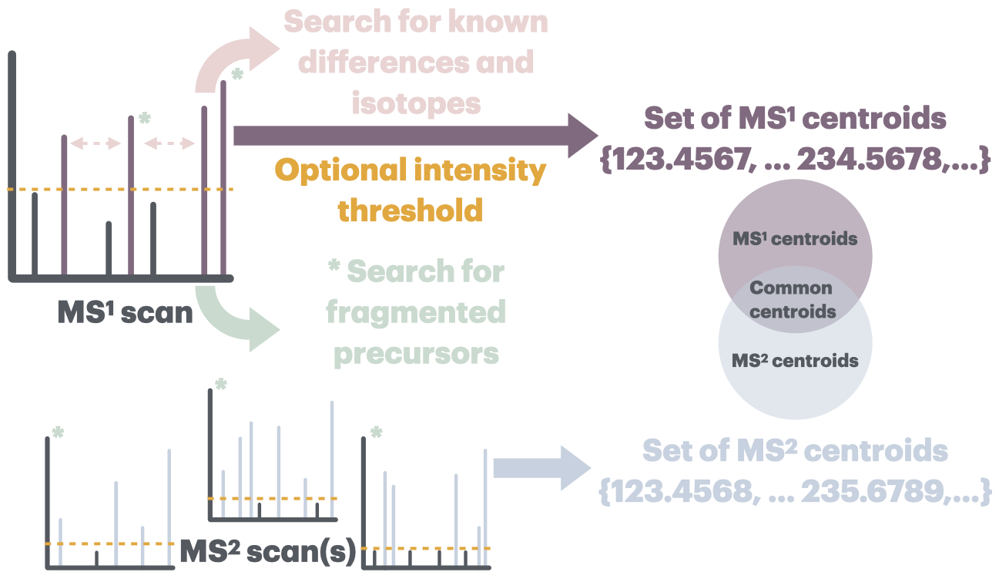

# ion-type-analysis

This repository contains the methods and code used to analyze ion types in <https://metabolomics.blog/2024/10/isf/>.

An overview of the process is illustrated below.



## Dependencies


### Software

To replicate our analysis, you will need the following software:

- The custom MZmine version available from the <https://github.com/Adafede/mzmine/tree/fragments_analysis> fork 
  - As it is not yet included in the latest MZmine version, building it might be _not so simple_... for details about installation, refer to <https://mzmine.github.io/mzmine_documentation/contribute_intellij.html>.
- [Python](https://www.python.org/) (>=3.10)
  - Poetry:
    ```bash
    curl -sSL https://install.python-poetry.org | python3 -
    ````
  - to install python dependencies:
    ```bash
    poetry install
    ```
- [R](https://www.r-project.org/) (>=4.3) (to reproduce the figures)

### Files

In case you just want to give a quick try, 6 example files are provided in `data/example/*.mzml`.

To replicate the full analysis, you will need the following datasets:

- Direct Injection ToF 20ev Positive: :warning: TO BE UPLOADED SOON :warning:
- Direct Injection ToF 40ev Positive: :warning: TO BE UPLOADED SOON :warning:
- Direct Injection ToF 60ev Positive: :warning: TO BE UPLOADED SOON :warning:
- Direct Injection Obitrap Positive: [zenodo.13890851](https://doi.org/10.5281/zenodo.13890851)
- Direct Injection Obitrap Negative: [zenodo.13890851](https://doi.org/10.5281/zenodo.13890851)
- Liquid Chromatography Astral Positive: [MSV000093526](https://massive.ucsd.edu/ProteoSAFe/dataset.jsp?task=5b9076c6cd134284806672033569996e)

For the files on MASSIVE, a convenience script using <https://github.com/Wang-Bioinformatics-Lab/downloadpublicdata> is available:

```bash
poetry run python3 ./notebooks/download_massive.py ./data/MSV000093526.txt /Volumes/T7_Shield/MSV000093526 /Volumes/T7_Shield/MSV000093526/MSV000093526_summary.tsv
```

For the files on Zenodo, a convenience script is available:

```bash
poetry run python3 ./notebooks/download_zenodo.py https://doi.org/10.5281/zenodo.13890851 20220601_mzml_mce_bioactive_positive.zip /Volumes/T7_Shield/20220601_mzml_mce_bioactive_positive.zip.zip --unzip

poetry run python3 ./notebooks/download_zenodo.py https://doi.org/10.5281/zenodo.13890851 20230130_mzml_mce_bioactive_negative.zip /Volumes/T7_Shield/20230130_mzml_mce_bioactive_negative.zip --unzip

poetry run python3 ./notebooks/download_zenodo.py https://doi.org/10.5281/zenodo.13890851 20230404_mzml_pluskal_nih_negative.zip /Volumes/T7_Shield/20230404_mzml_pluskal_nih_negative.zip --unzip

poetry run python3 ./notebooks/download_zenodo.py https://doi.org/10.5281/zenodo.13890851 20230404_mzml_pluskal_nih_positive.zip /Volumes/T7_Shield/20230404_mzml_pluskal_nih_positive.zip --unzip

poetry run python3 ./notebooks/download_zenodo.py https://doi.org/10.5281/zenodo.13890851 20231123_mzml_mce_scaffold_negative.zip /Volumes/T7_Shield/20231123_mzml_mce_scaffold_negative.zip --unzip

poetry run python3 ./notebooks/download_zenodo.py https://doi.org/10.5281/zenodo.13890851 20231123_mzml_mce_scaffold_positive.zip /Volumes/T7_Shield/20231123_mzml_mce_scaffold_positive.zip --unzip

poetry run python3 ./notebooks/download_zenodo.py https://doi.org/10.5281/zenodo.13890851 20231124_mzml_otavapep_negative.zip /Volumes/T7_Shield/20231124_mzml_otavapep_negative.zip --unzip

poetry run python3 ./notebooks/download_zenodo.py https://doi.org/10.5281/zenodo.13890851 20231124_mzml_otavapep_positive.zip /Volumes/T7_Shield/20231124_mzml_otavapep_positive.zip --unzip

poetry run python3 ./notebooks/download_zenodo.py https://doi.org/10.5281/zenodo.13890851 mzml_20240405_pluskal_enammol_MSn_negative.zip /Volumes/T7_Shield/mzml_20240405_pluskal_enammol_MSn_negative.zip --unzip

poetry run python3 ./notebooks/download_zenodo.py https://doi.org/10.5281/zenodo.13890851 mzml_20240405_pluskal_enammol_MSn_positive.zip /Volumes/T7_Shield/mzml_20240405_pluskal_enammol_MSn_positive.zip --unzip

poetry run python3 ./notebooks/download_zenodo.py https://doi.org/10.5281/zenodo.13890851 mzml_20240408_pluskal_mcedrug_MSn_negative.zip /Volumes/T7_Shield/mzml_20240408_pluskal_mcedrug_MSn_negative.zip --unzip

poetry run python3 ./notebooks/download_zenodo.py https://doi.org/10.5281/zenodo.13890851 mzml_20240408_pluskal_mcedrug_MSn_positive.zip /Volumes/T7_Shield/mzml_20240408_pluskal_mcedrug_MSn_positive.zip --unzip

poetry run python3 ./notebooks/download_zenodo.py https://doi.org/10.5281/zenodo.13890851 mzml_20240502_pluskal_enamdisc_MSn_negative.zip /Volumes/T7_Shield/mzml_20240502_pluskal_enamdisc_MSn_negative.zip --unzip

poetry run python3 ./notebooks/download_zenodo.py https://doi.org/10.5281/zenodo.13890851 mzml_20240502_pluskal_enamdisc_MSn_positive.zip /Volumes/T7_Shield/mzml_20240502_pluskal_enamdisc_MSn_positive.zip --unzip
```

## Performing the analysis

To use the MZmine ion type analysis module:

### Example

```bash
# NOTE: `mzmine-dev` refers to the MZmine executable built from the above mentioned branch
mzmine-dev -batch ".mzmine/batch/di_tof_example.mzbatch" -i "./data/example/*.mzML" -o "./data/example/di_tof_10_20ev_pos/{}"
```

This will give you the results for the example file.

### Full

To reproduce the full results:

:warning: not fully working for now because of the required libraries for standards annotation!

:warning: not fully working for now because of DI-ToF dataset not being available!

```bash
mzmine-dev -t "/Volumes/T7_Shield/tmp" -b ".mzmine/batch/di_ot_5_enamdisc_neg.mzbatch" -i "/Volumes/T7_Shield/mzml_20240502_pluskal_enamdisc_MSn_negative/*.mzML" -o "./data/di_ot_5_enamdisc_neg/{}"

mzmine-dev -t "/Volumes/T7_Shield/tmp" -b ".mzmine/batch/di_ot_5_enamdisc_pos.mzbatch" -i "/Volumes/T7_Shield/mzml_20240502_pluskal_enamdisc_MSn_positive/*.mzML" -o "./data/di_ot_5_enamdisc_pos/{}"

mzmine-dev -t "/Volumes/T7_Shield/tmp" -b ".mzmine/batch/di_ot_5_enammol_neg.mzbatch" -i "/Volumes/T7_Shield/mzml_20240405_pluskal_enammol_MSn_negative/*.mzML" -o "./data/di_ot_5_enammol_neg/{}"

mzmine-dev -t "/Volumes/T7_Shield/tmp" -b ".mzmine/batch/di_ot_5_enammol_pos.mzbatch" -i "/Volumes/T7_Shield/mzml_20240405_pluskal_enammol_MSn_positive/*.mzML" -o "./data/di_ot_5_enammol_pos/{}"

mzmine-dev -t "/Volumes/T7_Shield/tmp" -b ".mzmine/batch/di_ot_5_mcebio_neg.mzbatch" -i "/Volumes/T7_Shield/20230130_mzml_mce_bioactive_negative/*.mzML" -o "./data/di_ot_5_mcebio_neg/{}"

mzmine-dev -t "/Volumes/T7_Shield/tmp" -b ".mzmine/batch/di_ot_5_mcebio_pos.mzbatch" -i "/Volumes/T7_Shield/20220601_mzml_mce_bioactive_positive/*.mzML" -o "./data/di_ot_5_mcebio_pos/{}"

mzmine-dev -t "/Volumes/T7_Shield/tmp" -b ".mzmine/batch/di_ot_5_mcedrug_neg.mzbatch" -i "/Volumes/T7_Shield/mzml_20240408_pluskal_mcedrug_MSn_negative/*.mzML" -o "./data/di_ot_5_mcedrug_neg/{}"

mzmine-dev -t "/Volumes/T7_Shield/tmp" -b ".mzmine/batch/di_ot_5_mcedrug_pos.mzbatch" -i "/Volumes/T7_Shield/mzml_20240408_pluskal_mcedrug_MSn_positive/*.mzML" -o "./data/di_ot_5_mcedrug_pos/{}"

mzmine-dev -t "/Volumes/T7_Shield/tmp" -b ".mzmine/batch/di_ot_5_mcescaf_neg.mzbatch" -i "/Volumes/T7_Shield/20231123_mzml_mce_scaffold_negative/*.mzML" -o "./data/di_ot_5_mcescaf_neg/{}"

mzmine-dev -t "/Volumes/T7_Shield/tmp" -b ".mzmine/batch/di_ot_5_mcescaf_pos.mzbatch" -i "/Volumes/T7_Shield/20231123_mzml_mce_scaffold_positive/*.mzML" -o "./data/di_ot_5_mcescaf_pos/{}"

mzmine-dev -t "/Volumes/T7_Shield/tmp" -b ".mzmine/batch/di_ot_5_nihnp_neg.mzbatch" -i "/Volumes/T7_Shield/20230404_mzml_pluskal_nih_negative/*.mzML" -o "./data/di_ot_5_nihnp_neg/{}"

mzmine-dev -t "/Volumes/T7_Shield/tmp" -b ".mzmine/batch/di_ot_5_nihnp_pos.mzbatch" -i "/Volumes/T7_Shield/20230404_mzml_pluskal_nih_positive/*.mzML" -o "./data/di_ot_5_nihnp_pos/{}"

mzmine-dev -t "/Volumes/T7_Shield/tmp" -b ".mzmine/batch/di_ot_5_otavapep_neg.mzbatch" -i "/Volumes/T7_Shield/20231124_mzml_otavapep_negative/*.mzML" -o "./data/di_ot_5_otavapep_neg/{}"

mzmine-dev -t "/Volumes/T7_Shield/tmp" -b ".mzmine/batch/di_ot_5_otavapep_pos.mzbatch" -i "/Volumes/T7_Shield/20231124_mzml_otavapep_positive/*.mzML" -o "./data/di_ot_5_otavapep_pos/{}"

mzmine-dev -t "/Volumes/T7_Shield/tmp" -b ".mzmine/batch/di_tof_0_pos.mzbatch" -i "/Volumes/T7_Shield/01_zeno/all_converted/CID/20/*.mzML" -o "./data/di_tof_0_20ev_pos/{}"

mzmine-dev -t "/Volumes/T7_Shield/tmp" -b ".mzmine/batch/di_tof_5_pos.mzbatch" -i "/Volumes/T7_Shield/01_zeno/all_converted/CID/20/*.mzML" -o "./data/di_tof_5_20ev_pos/{}"

mzmine-dev -t "/Volumes/T7_Shield/tmp" -b ".mzmine/batch/di_tof_10_pos.mzbatch" -i "/Volumes/T7_Shield/01_zeno/all_converted/CID/20/*.mzML" -o "./data/di_tof_10_20ev_pos/{}"

mzmine-dev -t "/Volumes/T7_Shield/tmp" -b ".mzmine/batch/di_tof_0_pos.mzbatch" -i "/Volumes/T7_Shield/01_zeno/all_converted/CID/40/*.mzML" -o "./data/di_tof_0_40ev_pos/{}"

mzmine-dev -t "/Volumes/T7_Shield/tmp" -b ".mzmine/batch/di_tof_5_pos.mzbatch" -i "/Volumes/T7_Shield/01_zeno/all_converted/CID/40/*.mzML" -o "./data/di_tof_5_40ev_pos/{}"

mzmine-dev -t "/Volumes/T7_Shield/tmp" -b ".mzmine/batch/di_tof_10_pos.mzbatch" -i "/Volumes/T7_Shield/01_zeno/all_converted/CID/40/*.mzML" -o "./data/di_tof_10_40ev_pos/{}"

mzmine-dev -t "/Volumes/T7_Shield/tmp" -b ".mzmine/batch/di_tof_0_pos.mzbatch" -i "/Volumes/T7_Shield/01_zeno/all_converted/CID/60/*.mzML" -o "./data/di_tof_0_60ev_pos/{}"

mzmine-dev -t "/Volumes/T7_Shield/tmp" -b ".mzmine/batch/di_tof_5_pos.mzbatch" -i "/Volumes/T7_Shield/01_zeno/all_converted/CID/60/*.mzML" -o "./data/di_tof_5_60ev_pos/{}"

mzmine-dev -t "/Volumes/T7_Shield/tmp" -b ".mzmine/batch/di_tof_10_pos.mzbatch" -i "/Volumes/T7_Shield/01_zeno/all_converted/CID/60/*.mzML" -o "./data/di_tof_10_60ev_pos/{}"

mzmine-dev -t "/Volumes/T7_Shield/tmp" -b ".mzmine/batch/lc_at_5_pos.mzbatch" -i "/Volumes/T7_Shield/MSV000093526/*.mzML" -o "./data/lc_at_5_pos/{}"
```

#### Standards annotation

To speed up the process on the large sets, we first detect features corresponding to the injected compounds only (we still link all other ones later on).
For this, you'll need the library files available in :warning: `TODO` :warning: to filter the number of features on which the analysis is performed.
This is absolutely not required (so you can apply the methodology on complex, unknown samples), the analysis will just take longer.

#### Known issues and fixes

Some of the zip contain `.file.mzML`. To get rid of those:

```bash
rm .??*
```

Some of the runs did not get any match:

```bash
poetry run python3 ./notebooks/remove_empty.py -d ./data/di_ot_5_enamdisc_neg

poetry run python3 ./notebooks/remove_empty.py -d ./data/di_ot_5_enamdisc_pos

poetry run python3 ./notebooks/remove_empty.py -d ./data/di_ot_5_enammol_neg

poetry run python3 ./notebooks/remove_empty.py -d ./data/di_ot_5_enammol_pos

poetry run python3 ./notebooks/remove_empty.py -d ./data/di_ot_5_mcebio_neg

poetry run python3 ./notebooks/remove_empty.py -d ./data/di_ot_5_mcebio_pos

poetry run python3 ./notebooks/remove_empty.py -d ./data/di_ot_5_mcedrug_neg

poetry run python3 ./notebooks/remove_empty.py -d ./data/di_ot_5_mcedrug_pos

poetry run python3 ./notebooks/remove_empty.py -d ./data/di_ot_5_mcescaf_neg

poetry run python3 ./notebooks/remove_empty.py -d ./data/di_ot_5_mcescaf_pos

poetry run python3 ./notebooks/remove_empty.py -d ./data/di_ot_5_nihnp_neg

poetry run python3 ./notebooks/remove_empty.py -d ./data/di_ot_5_nihnp_pos

poetry run python3 ./notebooks/remove_empty.py -d ./data/di_ot_5_otavapep_neg

poetry run python3 ./notebooks/remove_empty.py -d ./data/di_ot_5_otavapep_pos

poetry run python3 ./notebooks/remove_empty.py -d ./data/di_ot_5_otavapep_pos

poetry run python3 ./notebooks/remove_empty.py -d ./data/di_tof_0_20ev_pos

poetry run python3 ./notebooks/remove_empty.py -d ./data/di_tof_0_40ev_pos

poetry run python3 ./notebooks/remove_empty.py -d ./data/di_tof_0_60ev_pos

poetry run python3 ./notebooks/remove_empty.py -d ./data/di_tof_5_20ev_pos

poetry run python3 ./notebooks/remove_empty.py -d ./data/di_tof_5_40ev_pos

poetry run python3 ./notebooks/remove_empty.py -d ./data/di_tof_5_60ev_pos

poetry run python3 ./notebooks/remove_empty.py -d ./data/di_tof_10_20ev_pos

poetry run python3 ./notebooks/remove_empty.py -d ./data/di_tof_10_40ev_pos

poetry run python3 ./notebooks/remove_empty.py -d ./data/di_tof_10_60ev_pos
```

## Reproducing the figures

You can reproduce the figures by using the following command:

```bash
# NOTE: remove the `--args example=TRUE` if you have all datasets
R < ./inst/scripts/plot_figures.R --no-save --args example=TRUE
```

## Acknowledgments

Listed alphabetically below are the individuals whose contributions—whether through sharing ideas, code, or data—have been essential to the current analysis:
- [Corinna](https://github.com/corinnabrungs)
- [Mario](https://orcid.org/0000-0003-2125-4184)
- [Robin](https://github.com/robinschmid)
- [Steffen](https://github.com/SteffenHeu)
- [Yasin](https://github.com/YasinEl)

## Contact

To promote transparency and dialogue, we encourage you to share your thoughts and questions in the discussions section (<https://github.com/zamboni-lab/ion-type-analysis/discussions>). 
Your contributions are important for improving our shared knowledge.
